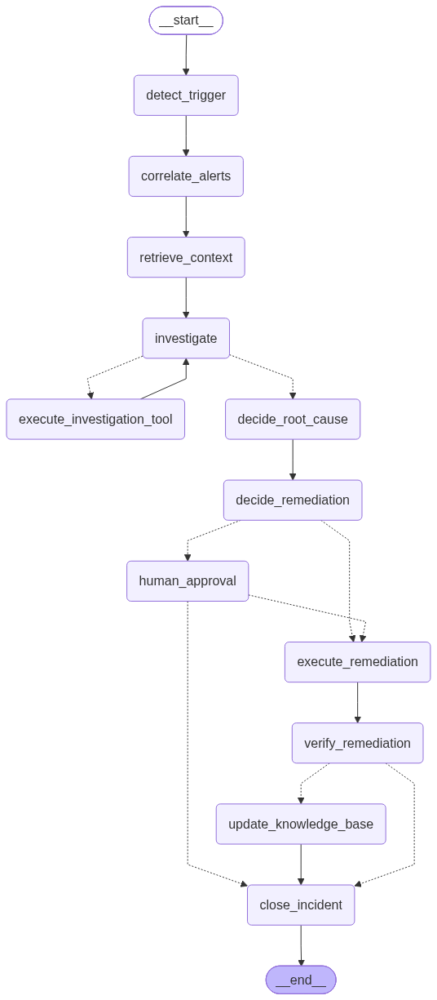

# Autonomous Enterprise Incident Resolution Engine (AI-01)

> An event-driven AI operations control plane that moves from alert detection, real-time correlation, parallel specialist investigation, evidence aggregation, policy-governed decisioning, safe autonomous remediation or human approval, independent verification, and operational memory learning.

---

## 🔄 Agent Loop Architecture (LangGraph + LangChain)

The core engine is orchestrated as a deterministic state machine via **LangGraph**, combining deterministic workflow control with autonomous LLM reasoning (**Qwen2.5:7b** + **BGE-M3** via local Ollama):



```text
MessageQueue (Alert Burst Ingestion)
    ↓
[detect_trigger] : Normalize alerts into unified event schema
    ↓
[correlate_alerts] : Cluster alerts by topology, time window, & dependencies → Incident
    ↓
[retrieve_context] : Vector search Knowledge Base for historical incidents & runbooks
    ↓
┌─── [investigate] <───────────────────────────────────────────────────────┐
│       ↓                                                                  │
│   Reason about evidence & hypotheses                                     │
│       ↓                                                                  │
│   (Need more evidence?) ─── YES ──> [execute_investigation_tool] ────────┘
│       ↓ NO                                  (Logs, Metrics, Deployments, KB)
│   Sufficient evidence gathered
│       ↓
[decide_root_cause] : Identify primary root cause & confidence score
    ↓
[decide_remediation] : Select fix & evaluate operational risk (LOW vs HIGH)
    ↓
(Policy / Risk Check)
   ├── HIGH RISK ──> [human_approval] (LangGraph interrupt() + checkpoint pause)
   │                      ↓ (Resumed by human)
   └── LOW RISK  ───────> [execute_remediation] : Safely mutate synthetic environment
                              ↓
                         [verify_remediation] : Check health & telemetry post-fix
                              ├── RECOVERED ────> [update_knowledge_base] : Index post-mortem
                              └── UNRECOVERED ──> [close_incident] : Escalate to human
                                                        ↓
                                                   [close_incident] : Finalize status & Audit Log
```

---

## 🧪 Proof-of-Concept: `Notebooks/experiments.ipynb`

A clean, self-contained, and fully runnable proof-of-concept for the agent loop is available in [`Notebooks/experiments.ipynb`](Notebooks/experiments.ipynb).

### 12 Notebook Sections:
1. **Environment & Configuration**: Centralized settings for Ollama (`qwen2.5:7b`, `bge-m3:latest`), connection health checks, and fallback mechanisms.
2. **Domain Models**: Pydantic v2 schemas for `Alert`, `Incident`, `Evidence`, `Hypothesis`, `InvestigationStep`, `RemediationAction`, and `AuditEvent`.
3. **Synthetic Enterprise Data**: Multi-service cascade failure (Payment API 504s, Worker queue lag, Redis connection exhaustion post `v1.8.2` deployment).
4. **Knowledge Base & Retrieval**: `InMemoryVectorStore` with `bge-m3:latest` for enterprise runbooks (`RB-REDIS-01`, `RB-PAY-02`) and historical incidents (`INC-2025-089`).
5. **Operational Tools**: LangChain `@tool` wrappers for logs, metrics, service health, recent deployments, and bounded safe remediation.
6. **LangGraph State**: Strongly-typed `AgentState` with annotated reducers (`operator.add`) for accumulating evidence and audit trails.
7. **Graph Nodes**: Discrete Python nodes for each stage of the incident lifecycle.
8. **Conditional Routing**: Explicit Python routing functions for cyclic investigation loops, policy gates, and health verification.
9. **Auditability**: Complete structured event stream with aligned timeline renderer.
10. **Checkpointing & HITL**: `MemorySaver` checkpointer with `interrupt()` and native `.get_graph().draw_mermaid_png()` rendering.
11. **End-to-End Primary Experiment**: Live execution of the cascading Redis connection leak scenario with human approval resumption.
12. **Experiments & Scorecard**: Quantitative metric scorecard + autonomous low-risk remediation scenario + verification failure escalation scenario.

---

## ⚡ Quickstart

### 1. Prerequisites (Local Ollama)
Ensure [Ollama](https://ollama.com/) is running locally with the required models:
```bash
ollama serve
ollama pull qwen2.5:7b
ollama pull bge-m3:latest
```

### 2. Environment Setup (Using `uv`)
Create and synchronize the virtual environment:
```bash
# Create venv and install dependencies
uv venv
uv add langgraph langchain-ollama langchain-core langchain pydantic nbformat ipykernel pillow grandalf requests numpy

# Activate virtual environment (Windows PowerShell)
.\.venv\Scripts\Activate.ps1

# Or on macOS/Linux:
# source .venv/bin/activate
```

### 3. Run the Proof-of-Concept Notebook
Open [`Notebooks/experiments.ipynb`](Notebooks/experiments.ipynb) in your IDE (VS Code, Cursor, or Jupyter Lab), select the **`.venv`** kernel, and run all cells.

Alternatively, execute via Jupyter:
```bash
jupyter notebook Notebooks/experiments.ipynb
```

---

## 👥 4-Person Monorepo Workstream Ownership

| Person | Workstream | Primary Directory | Description |
| :--- | :--- | :--- | :--- |
| **Person 1** | **Frontend / Incident Command Center** | `frontend/` | React + TypeScript + Vite SRE dashboard, real-time alert stream, parallel agents matrix, evidence drawer, approval flow, and audit timeline. |
| **Person 2** | **Platform / Ingestion / Orchestrator** | `backend/app/api/`, `ingestion/`, `orchestration/`, `domain/` | Canonical schemas, async event bus, authoritative state machine, REST endpoints, SSE/WS streaming. |
| **Person 3** | **Correlation / Parallel Investigation** | `backend/app/correlation/`, `investigation/`, `mock_data/` | Hybrid correlation scoring, 5 specialist concurrent agents, evidence aggregation, and hypothesis ranking. |
| **Person 4** | **Decision / Policy / Remediation / Memory / Audit** | `backend/app/decision/`, `policy/`, `remediation/`, `memory/`, `audit/` | Policy engine, autonomy levels, mock infrastructure executor, independent verifier, historical memory, and append-only audit trail. |

---

## 📖 Documentation
- [docs/architecture.md](docs/architecture.md) — System architecture, state machine, and data flow.
- [docs/contracts.md](docs/contracts.md) — REST endpoints, SSE event specifications, and inter-service schemas.
- [docs/demo-scenarios.md](docs/demo-scenarios.md) — Walkthroughs of the 4 judging demonstration scenarios.
- [docs/decisions.md](docs/decisions.md) — Architectural Decision Records (ADRs).
